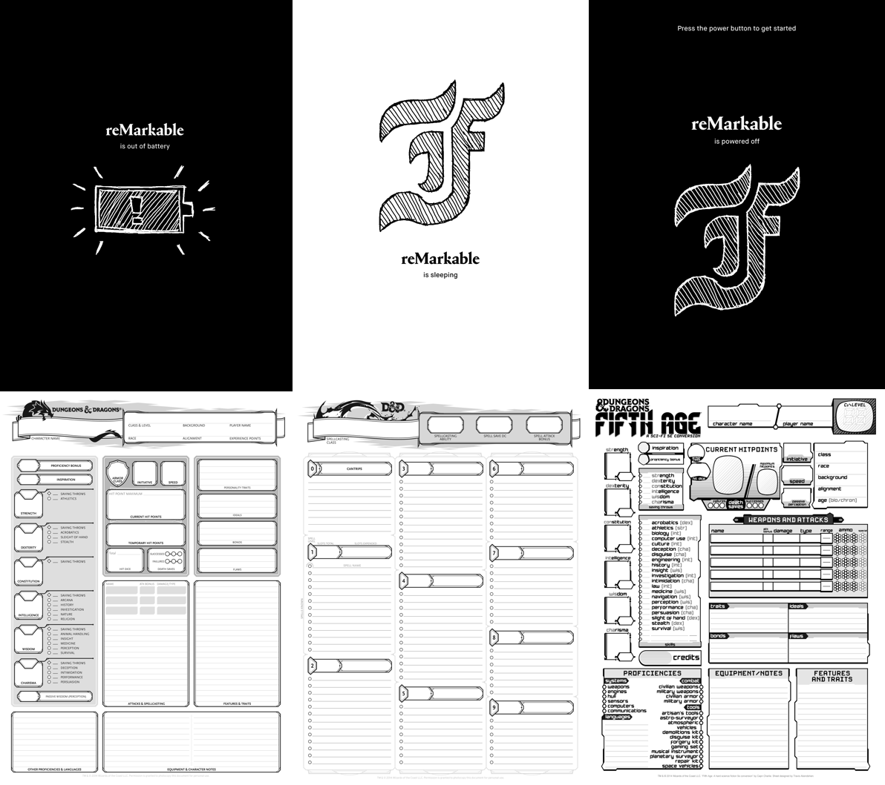

Matt's custom reMarkable stuff
==============================

You might like my custom templates and splashscreens, but more likely you
might find the information on how to create and install your own useful!


Contents
--------

* Instructions for manual installation of custom templates and splashscreens
  via USB cable (below).
* **TODO:** Instructions to configure ssh keys for easier install.
* **TODO:** Scripts to automatically install these templates.
* **TODO:** Instructions to create custom splashscreens and templates.
* My custom [templates](templates/):
  * Dungeons and Dragons 5E character sheet (front page, spells page).
  * Dungeons and Dragons 5E character sheet (fifth age)
    \[[homebrew source](https://www.enworld.org/threads/fifth-age-a-hard-science-fiction-5e-conversion.459300/)\]
    \[[character sheet](https://drive.google.com/file/d/0Bxu3eA5VG0daZFRIRTNyUkNYM0U/view?usp=sharing&resourcekey=0-Qbci97t88nh7LTGrJLW3sA)\].
* My custom [splashscreens](splashscreens/):
  * Out of power with a sketch of a battery logo (TODO: redo this)
  * Suspended and power off with a sketch of my initial (TODO: redo this)




Notes
-----

Be carefull connecting to your device over ssh. If you run the wrong commands,
you could effectively destroy your beloved e-paper tablet.
These instructions are released under an MIT license. In particular, no
warranty or liability is provided for anyone who chooses to follow these
instructions. You take responsibility for that. Please be careful!

The splashscreens are (modified versions of) those provided with the
reMarkable tablet, the originals of which retain copyright by Remarkable
AS, not me.
This repository is not affiliated with Remarkable AS.
The templates are derived from other materials which I do not claim copyright
for either.
I do not provide a license to use these materials (only the instructions).


Installation (first-time and after update)
------------------------------------------

1. Establish ssh access to the device (connect using a USB cable, and
   know your password; or, preferably, install keys to avoid having to
   type the password again and again---remind me to do this and write
   up a guide).

2. (After an update,) the ssh keys of the device will have changed, so
   you'll need to remove the old key from `.ssh/known_hosts` or you'll get 
   **Host key verification failed.**
   It's sufficient just to remove the line containing the tablet's IP from
   `.ssh/known_hosts` on your connecting device.

3. Follow the steps below to install templates and screens. The same steps
   should work for a first-time install and after each software update.


Templates
---------

**TODO:** make or link to instructions for creating templates.

**Installing:**

First, copy the PNG files in `templates/` into the device:

```
scp templates/*.png root@192.168.0.18:/usr/share/remarkable/templates/
```

Then, add the metadata from inside `templates/metadata.json` into
`/usr/share/remarkable/templates/templates.json`.
You have to interleave the JSON. I recommend:

```
pbcopy < templates/metadata.json
ssh root@192.168.0.18
# type password; unless you have configured ssh keys
vim /usr/share/remarkable/templates/templates.json
# or, nano instead of vim
# either way, interleave the json and save
```

TODO: Automate this with `diff`, `scp`, `patch`, and `scp` back (or
something).


Splash-screens
--------------

**TODO:** make or link to instructions for creating splashscreens (it's
super simple, just a `.png` file with the right name and size...!)

**Installing:**

Also simpler. Just get the files in `splashscreens/matt` into
`/usr/share/remarkable`.

You may want to preserve those that are already there if you haven't
already. Or, these can be used as a basis for modification into new
screens:

```
# WARNING: Only run this once or after a fresh update, or you will overwrite
# your backup with your custom skins... (I did this for v2.10, oops!)
mkdir -p splashscreens/orig/ 
scp root@192.168.0.18:'/usr/share/remarkable/*.png' splashscreens/orig
```

Then, copy the new skins to the same folder, overwriting the original ones.

```
scp splashscreens/matt/*.png root@192.168.0.18:/usr/share/remarkable/
```
